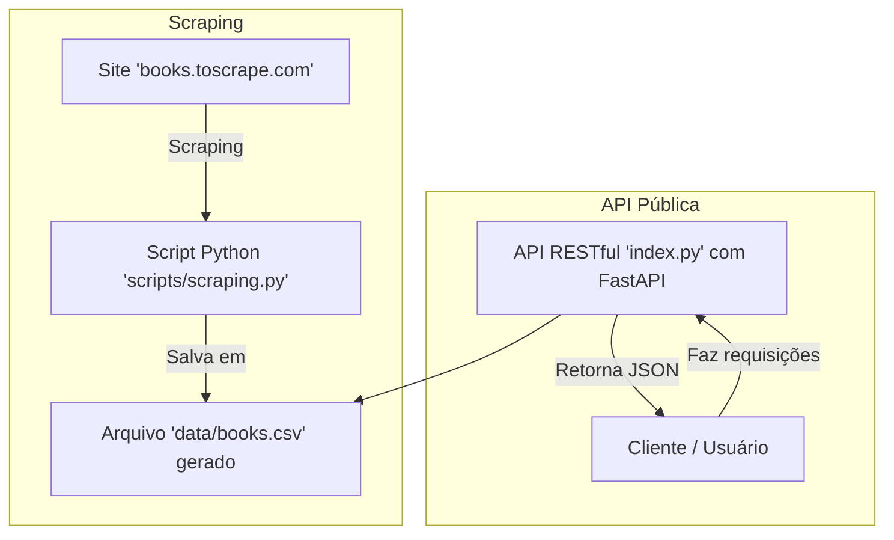

# 📚 Book Scraping API

Tech Challenge da Fase 1 da pós-graduação em **Machine Learning Engineering** (FIAP).  
API RESTful desenvolvida em **FastAPI** para fazer web scraping do catálogo de livros em https://books.toscrape.com/. Traz endpoints públicos para consulta do catálogo. O projeto está preparado para rodar localmente (Uvicorn) e em produção na **Vercel**.

- **Produção:** https://books-api-lilac.vercel.app/ (Redireciona para a documentação Swagger)
- **Vídeo de apresentação:** ...

---

## Arquitetura do projeto
O diagrama abaixo exemplifica de forma básica o funcionamento da API.

---

## Estrutura dos dados
Cada livro possui os seguintes campos (api/models.py):

| Campo     | Tipo  | Descrição                          |
|-----------|-------|------------------------------------|
| id        | int   | Identificador único                |
| title     | str   | Título do livro                    |
| price     | float | Preço em libras (£)                |
| rating    | int   | Avaliação de 1 a 5 estrelas        |
| available | int   | Número de exemplares disponíveis   |
| category  | str   | Categoria (gênero literário)       |
| image     | str   | URL da imagem da capa              |

---

## Instalação e configuração (local)

### Requisitos
- Python 3.12+ (recomendado 3.13 ou 3.14)

### Com `venv` e `pip`
```bash
# clonar o projeto
git clone https://github.com/mtmoss/Books-API.git
cd Books-API

# criar e ativar ambiente virtual
python3 -m venv .venv
source .venv/bin/activate  # macOS/Linux
# .venv\Scripts\activate  # Windows

# instalar dependências
pip install -r requirements.txt
```

### Executar o script
```
python scripts/scraping.py
```

### Rodar a API localmente
```
uvicorn index:app --reload
```

### Acessar a API
Disponível localmente em http://127.0.0.1:8000.

---

## Documentação da API (Swagger)

- **Produção:** https://books-api-lilac.vercel.app/docs  
- **Local:** http://127.0.0.1:8000/docs

---

## Rotas e Endpoints

### GET /api/v1/health
Retorna status básico do serviço.
- Resposta:
```
{"status": "ok"}
```

### GET /api/v1/books
Exibe a lista completa de livros extraídos do site https://books.toscrape.com/ e salvos localmente no arquivo data/books.csv.
- Resposta:
```
{
  "total": 1000,
  "items": [
    {
      "id": 1,
      "title": "It's Only the Himalayas",
      "price": 45.17,
      "rating": 2,
      "available": 19,
      "category": "Travel",
      "image": "http://books.toscrape.com/media/cache/6d/41/6d418a73cc7d4ecfd75ca11d854041db.jpg"
    },
    {
      "id": 2,
      "title": "Full Moon over Noah's Ark: An Odyssey to Mount Ararat and Beyond",
      "price": 49.43,
      "rating": 4,
      "available": 15,
      "category": "Travel",
      "image": "http://books.toscrape.com/media/cache/fe/8a/fe8af6ceec7718986380c0fde9b3b34f.jpg"
    },

    ...

    ]
```

### GET /api/v1/books/search
Permite buscar um livro por categoria ou título.
- Requisição HTTP:
```
.../api/v1/books/search?title=torment
```
- Resposta:
```
{
  "total": 1,
  "items": [
    {
      "id": 20,
      "title": "A Time of Torment (Charlie Parker #14)",
      "price": 48.35,
      "rating": 5,
      "available": 14,
      "category": "Mystery",
      "image": "http://books.toscrape.com/media/cache/f1/37/f137a410ed7d6fcfce17d081caf97915.jpg"
    }
  ]
}
```

### GET /api/v1/books/categories
Exibe todas as categorias de livros.
- Resposta:
```
[
  "Academic",
  "Add a comment",
  "Adult Fiction",
  "Art",
  "Autobiography",
  "Biography",
  "Business",
  "Childrens",
  "Christian",
  "Christian Fiction",
  "Classics",
  "Contemporary",
  "Crime",
  "Cultural",
  "Default",

    ...

]
```

### GET /api/v1/books/{id}
Detalha um livro específico pelo `id`.
- Requisição HTTP:
```
.../api/v1/books/874
```
- Resposta:
```
{
  "id": 874,
  "title": "Psycho: Sanitarium (Psycho #1.5)",
  "price": 36.97,
  "rating": 5,
  "available": 12,
  "category": "Horror",
  "image": "http://books.toscrape.com/media/cache/91/98/9198cedbd37561f2aa343d3eb04ee703.jpg"
}
```
