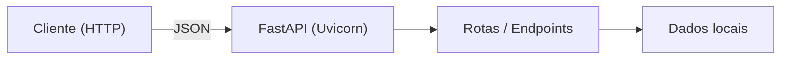

# 📚 Book Scraping API

Tech Challenge da Fase 1 da pós-graduação em **Machine Learning Engineering** (FIAP).  
API RESTful desenvolvida em **FastAPI** para fazer web scraping do catálogo de livros em https://books.toscrape.com/. Traz endpoints públicos para consulta do catálogo. O projeto está preparado para rodar localmente (Uvicorn) e em produção na **Vercel**.

- **Produção:** https://books-api-lilac.vercel.app/ (Redireciona para a documentação Swagger)
- **Vídeo de apresentação:** ...

---

## Arquitetura

- **FastAPI** como framework web (ASGI).  
- **Uvicorn** como servidor de desenvolvimento.  
- **Routers** organizando os endpoints (ex.: `status`, `books` e, opcionalmente, `auth`).  
- **Dados**: leitura de um arquivo local (pasta `data/`) ou lista em memória.

## Estrutura de pastas

```
Books-API/
├─ api/                 # Código da aplicação (routers, modelos, inicialização do FastAPI)
├─ data/                # Arquivos de dados (o .csv extraído do scraping)
├─ scripts/             # Script de web scraping
├─ requirements.txt     # Lista de dependências para deploy
├─ poetry.lock          # Lockfile do Poetry (gerado com 2.2.1)
├─ vercel.json          # Configuração de roteamento para produção
└─ README.md
```

> Em produção, a raiz (`/`) redireciona para `/docs` (Swagger). Configurado no `vercel.json`.

---

## Instalação e configuração (local)

### Requisitos
- Python 3.11+ (recomendado 3.13 ou 3.14)
- Opcional: Poetry 2.x

### Opção A — com `venv` e `pip`
```bash
# clonar o projeto
git clone https://github.com/mtmoss/Books-API.git
cd Books-API

# criar e ativar ambiente virtual
python3 -m venv .venv
source .venv/bin/activate  # macOS/Linux
# .venv\Scripts\activate  # Windows

# instalar dependências
pip install -r requirements.txt
```

### Opção B — com `poetry`
```bash
# clonar o projeto
git clone https://github.com/mtmoss/Books-API.git
cd Books-API

# instalar dependências
poetry install

# ativar o shell do projeto
poetry shell
```

### Executar o script
```python scripts/scraping.py```

### Rodar a API localmente
```uvicorn index:app --reload```

### Acessar a API
Disponível localmente em http://127.0.0.1:8000.

---

## Documentação da API (Swagger)

- **Produção:** https://books-api-lilac.vercel.app/docs  
- **Local:** http://127.0.0.1:8000/docs

---

## Rotas e Endpoints

### Status / Healthcheck
- `GET /api/v1/health` — retorna informações básicas de saúde do serviço (ex.: `{"status": "ok"}`).

### Livros
- `GET /api/v1/books` — exibe a lista completa de livros.
- `GET /api/v1/books/search` — permite buscar um livro por categoria ou título.
- `GET /api/v1/books/categories` — exibe todas as categorias de livros.
- `GET /api/v1/books/{id}` — detalha um livro específico pelo `id`.